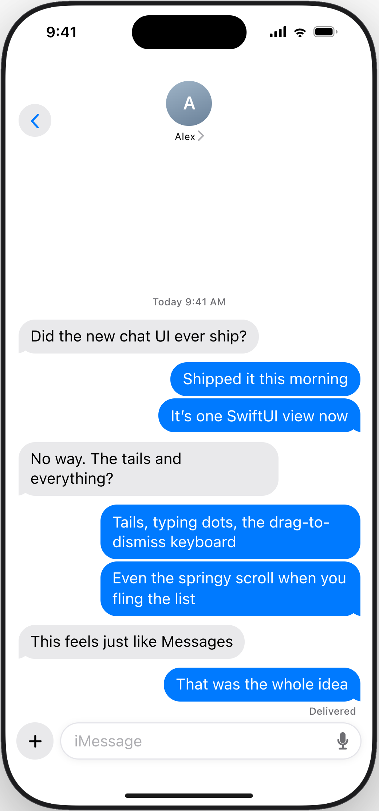

<div align="center">

# Swift Chat

The Messages app, as a SwiftUI view.

[swiftchat.app](https://swiftchat.app) · [Documentation](https://www.swiftipedia.org/documentation/unionchat) · [llms.txt](https://swiftchat.app/llms.txt) · by [Union St](https://unionst.com)



</div>

Swift Chat is a drop-in chat transcript for iOS. Hand it your messages and it renders them the way Messages does: bubble tails that land on the last message in a run, typing dots, delivery and read receipts, photo and video and file attachments, a keyboard that follows your finger, and a scroll with real weight to it. A UIKit collection view does the work underneath. SwiftUI is the only API you touch.

## What's built in

- **Bubbles** with automatic tail placement, grouping by sender, and timestamp separators.
- **Typing indicators** for one person or a crowd.
- **Delivery states**: sending, sent, delivered, read, failed.
- **Attachments**: images with BlurHash placeholders, video, audio with waveforms, files, locations, and polls.
- **The input bar**: text, dictation, a plus button for photos and files, and an async send hook.
- **Keyboard handling**: interactive dismissal and safe-area management that matches Messages.
- **Group chats**: avatars and sender names appear on their own once three people are in the thread.
- **Pagination**: load older messages at the top with a built-in spinner.
- **Context menus and taps** delivered through UIKit's own event path, so they always fire.
- **Haptics** on incoming messages, a scroll-to-bottom button, an empty state, and custom headers.
- **Dark mode, Dynamic Type, and the iOS 26 glass look**, because it is built from the system's own materials.

## Requirements

- iOS 18 or later
- Xcode 16 or later
- Swift 6.1 or later

## Installation

In Xcode choose File › Add Package Dependencies and paste:

```
https://github.com/unionst/swift-chat.git
```

Or add it to `Package.swift`:

```swift
dependencies: [
    .package(url: "https://github.com/unionst/swift-chat.git", from: "1.0.0")
],
targets: [
    .target(
        name: "MyApp",
        dependencies: [
            .product(name: "SwiftChat", package: "swift-chat")
        ]
    )
]
```

## Quick start

```swift
import SwiftUI
import SwiftChat

struct ConversationView: View {
    @State private var conversation = Conversation()

    var body: some View {
        Chat(conversation.messages) { message in
            Message(message.text, role: message.role, timestamp: message.sentAt)
                .messageStatus(message.status)
        }
        .chatTypingIndicators(conversation.typing)
        .chatInputPlaceholder("iMessage")
        .chatInputCapabilities([.photoLibrary, .files])
        .onChatSend { text, media in
            await conversation.send(text, media)
        }
    }
}

@MainActor @Observable
final class Conversation {
    var messages: [ChatMessage] = []
    var typing: [ChatRole] = []

    func send(_ text: String?, _ media: MessageMedia?) async {
        let message = ChatMessage(text: text ?? "", role: .me, sentAt: .now, status: .sending)
        messages.append(message)
        await api.deliver(message, attachment: media)
    }
}

struct ChatMessage: Identifiable {
    let id = UUID()
    var text: String
    var role: ChatRole
    var sentAt: Date
    var status: ChatDeliveryStatus?
}
```

`Chat` accepts any `RandomAccessCollection` of `Identifiable` values plus a closure that turns each one into a `Message`. Your model stays yours; nothing has to conform to a protocol.

### Declarative form

Messages can also be written out directly, with the same conditionals and loops you use in SwiftUI:

```swift
Chat {
    Message("Welcome to support", role: .system, timestamp: .now)

    ForEach(messages) { message in
        Message(message.text, role: message.role, timestamp: message.sentAt)
    }

    if showHint {
        Message("Ask anything.", role: .user(id: "bot", displayName: "Assistant"), timestamp: .now)
    }
}
```

### Roles

| Role | Rendered as |
|---|---|
| `.me` | Outgoing bubble on the right |
| `.user(id:displayName:)` | Incoming bubble on the left, with avatar and name in group chats |
| `.system` | Centered gray text with no bubble |

## Messages

Every `Message` takes text, a role, and a timestamp. Modifiers add the rest:

```swift
Message(message.text, role: message.role, timestamp: message.sentAt)
    .messageStatus(.read)
    .messageMedia(.image(url: photoURL, width: 1200, height: 800, blurhash: "LEHV6nWB2yk8pyo0adR*.7kCMdnj"))
    .messageHeader { Text("Alex").font(.caption) }
    .messageFooter { Text("Edited").font(.caption2) }
    .messageAvatar { AvatarView(user: message.sender) }
    .messageStyle(.plain)
    .contextMenu {
        Button("Copy") { copy(message) }
    }
```

| Modifier | What it does |
|---|---|
| `messageStatus(_:)` | Shows sending, sent, delivered, read, or failed under the bubble |
| `messageMedia(_:)` | Attaches an image, video, audio clip, file, location, or poll |
| `messageAttachment { }` | Renders a custom SwiftUI view as the attachment |
| `messageHeader { }` | A view above the bubble, such as a sender name |
| `messageFooter { }` | A view below the bubble |
| `messageAvatar { }` | A custom avatar for incoming messages |
| `messageStyle(_:)` | `.default` for bubbles, `.plain` for bare text |
| `font(_:)` | Overrides the bubble text font |
| `contextMenu { }` | A long-press menu for that message |
| `contentVersion(_:)` | Forces a re-render when content changes but the id does not |

### Attachments

```swift
MessageMedia.image(url: URL, width: Int? = nil, height: Int? = nil, blurhash: String? = nil)
MessageMedia.video(url: URL, thumbnailURL: URL? = nil, duration: TimeInterval? = nil)
MessageMedia.audio(url: URL, duration: TimeInterval? = nil, waveform: [Float]? = nil)
MessageMedia.file(url: URL, name: String, size: Int64? = nil, mimeType: String? = nil)
MessageMedia.location(latitude: Double, longitude: Double, name: String? = nil)
MessageMedia.poll(question: String, options: [String], votes: [Int]? = nil)
```

Pass width and height for images to get correctly sized placeholders with no layout shift. Pass a BlurHash to show a blurred preview while the image loads.

## Chat modifiers

All of these are ordinary SwiftUI view modifiers applied to `Chat`.

| Modifier | What it does |
|---|---|
| `chatInputPlaceholder(_:)` | Placeholder text in the input field. Default is "Message". |
| `chatInputCapabilities(_:)` | Which attachments the plus button offers: `.photoLibrary`, `.files`, or `[]` for text only |
| `onChatSend { text, media in }` | Async handler called when the user sends. Either value may be nil. |
| `onChatTypingChanged { isTyping in }` | Fires as the user starts and stops typing, for sending typing events to your server |
| `chatTypingIndicators(_:)` | Shows typing dots for the given `[ChatRole]` |
| `chatHeader { }` | A SwiftUI view pinned above the transcript |
| `chatEmptyView { }` | What to show when there are no messages |
| `chatAutoscrollBehavior(_:)` | `.whenAtBottom` (default), `.always`, or `.never`. A scroll-to-bottom button appears when needed. |
| `chatLoadsOlderMessages { }` | Async loader called at the top of the transcript. Return `false` when nothing older remains. |
| `onChatScrollEdge(_:perform:)` | Callback when the reader reaches the top or bottom edge |
| `onMessagesEvictable { ids in }` | Tells you which off-screen message ids can be dropped in very long threads |
| `chatMessageContextMenu { id in [ChatContextMenuItem] }` | Long-press menu items per message, as data |
| `onChatMessageTap { id in }` | Tap handler per message |
| `chatSenderInfo(_:)` | `.automatic` shows avatars and names in group chats only; `.always` shows them everywhere |
| `chatBubbleStyle(_:)` | Any `ShapeStyle` for outgoing bubbles. `.tint(_:)` also works. |
| `chatBubbleTailsHidden(_:)` | Hides bubble tails |
| `chatInputBarTint(_:)` | A translucent tint over the input bar's glass |
| `chatHapticsDisabled(_:)` | Turns off the tap on incoming messages |
| `chatPaginationAnimated(_:)` | Whether bubbles animate during rapid bursts of messages |

### Loading older messages

```swift
Chat(conversation.messages) { message in
    Message(message.text, role: message.role, timestamp: message.sentAt)
}
.chatLoadsOlderMessages {
    await conversation.loadOlderPage()
}
```

The transcript shows its own spinner above the oldest message while the closure runs and keeps the reader's position when the new page lands.

### Custom header

```swift
Chat(conversation.messages) { message in
    Message(message.text, role: message.role, timestamp: message.sentAt)
}
.chatHeader {
    HStack {
        AvatarView(user: alex)
        VStack(alignment: .leading) {
            Text("Alex").font(.headline)
            Text("Online").font(.caption).foregroundStyle(.green)
        }
    }
}
```

## For AI coding agents

Swift Chat publishes an [llms.txt](https://swiftchat.app/llms.txt) and a [full reference](https://swiftchat.app/llms-full.txt). If you are using Claude Code, Cursor, Codex, or another agent, paste this:

```
Add Swift Chat to this iOS app. Package URL https://github.com/unionst/swift-chat.git,
product "SwiftChat", iOS 18+. Read https://swiftchat.app/llms-full.txt first, then build the
conversation screen with Chat(messages) { Message($0.text, role: $0.role, timestamp: $0.sentAt) }
and wire sending with .onChatSend.
```

## Migrating from UnionChat

Swift Chat was previously published as UnionChat. The package keeps a `UnionChat` product, so `import UnionChat` still compiles; the old repository URL redirects here. New code should depend on the `SwiftChat` product and `import SwiftChat`. No types were renamed.

## License

Swift Chat is free to use in any app, including commercial ones, and ships as a closed-source binary the same way Apple distributes its own frameworks. See [LICENSE](LICENSE) for the short version of what that means. Teams that want source access or custom terms can write to [hello@unionst.com](mailto:hello@unionst.com).

<div align="center">

Made by [Union St](https://unionst.com)

</div>
